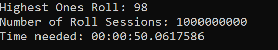

# What's this for?
This is a small programm in order to find a possible answer to the question in this video https://www.youtube.com/watch?v=M8C8dHQE2Ro

# Some results

# Hardware
- Ryzen 9 3950X
- 32 GB DDR4, 3200 MHz
- Nvidia RTX 3080 (although this shouldn't matter)

# Notes
- running this programm will most likely use 100% of all your CPU cores
- the time measuring method is quite rudimentary since using a more sophisticated benchmarking tool like BenchmarkDotNet would result in a bluescreen. The benchmarking classes are included nontheless.